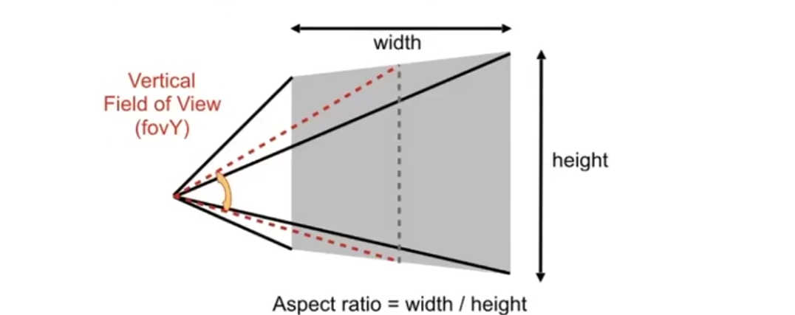

"看上去是对的，那就是对的"

<!--more-->

> 在进行 Viewing Transformation 后, 所有的物体都变换到了 $[-1,1]^3$ 中

> **几个概念**
>
> - 垂直视角 Field of View
> - 宽高比 aspect ratio
>
> 

### 视口变换 Viewport Transformation

> **屏幕建模**
>
> - 像素的二维数组
> - 数组的大小称为分辨率
> - 光栅成像设备 (将物体画在屏幕上)

> **屏幕空间**
>
> - 由不同的定义方式
> - 坐标的原点在 **数组的左下角**
> - 向右为$x$轴, 向上为$y$轴
> - 像素的中心为$(x+0.5,y+0.5)$

> **视口变换**
>
> - 将$[-1,1]^3$变换到屏幕$[0,width]\times[0,height]$上
> - 先考虑$xy$两个维度, 不考虑$z$的深度, 变换矩阵为
> 
> $$
> M=
> \begin{bmatrix}
>     \frac{width}{2} & 0 & 0 & \frac{width}{2}  \\
>     0 & \frac{height}{2} & 0 & \frac{height}{2} \\
>     0 & 0 & 1 & 0 \\
>     0 & 0 & 0 & 1
> \end{bmatrix}
> $$

### 光栅化 Rasiterization

> **三角形 Triangle**
>
> - 最基本的多边形, 所有多边形可以拆分成三角形
> - 唯一确定一个平面
> - 能定义三角形的内外
> - 能比较好地在顶点间进行插值
> - 因此可以使用三角形组合去表示任意物体

> **采样 Sampling**
>
> - 采样是将函数离散化的过程

```c++
for (auto x {0}; x < x_max; ++x) {
    output[x] = f(x);
}
```

> - 在图形学中, 用像素中心对屏幕进行采样
> - 可以定义如下函数输出像素点与某个三角形的内外关系

```c++
int inside(const &Triangle t, const &Point (x, y)) {
    return ((x,y) in t)? 1 : 0;
}
for (auto x {0}; x < x_max; ++x) {
    for (auto y {0}; y < y_max; ++y) {
        image[x][y] = inside(triangle, (x + 0.5, y + 0.5));
    }
}
```

> `inside()`函数的具体实现: 向量叉积
>
> - $\bigtriangleup ABC$ 与平面内的点 $P$ 的关系:
> - 若 $\vec{AB}, \vec{BC}, \vec{CA}$ 与 $P$ 的叉积结果 **同向** 则 $P$ 在三角形内部, 反之在外部

> **考虑遍历像素的效率问题**
>
> - 没必要对一个三角形遍历每一个像素
> - 寻找三角形的包围盒 Bounding Box (轴向, 简称 AABB)
> - 确定`x_min`, `x_max`, `y_min`和`y_max`为三角形对应的最小, 最大坐标值
>
> 另一种方法:
>
> - 对每一行取最值为遍历的范围