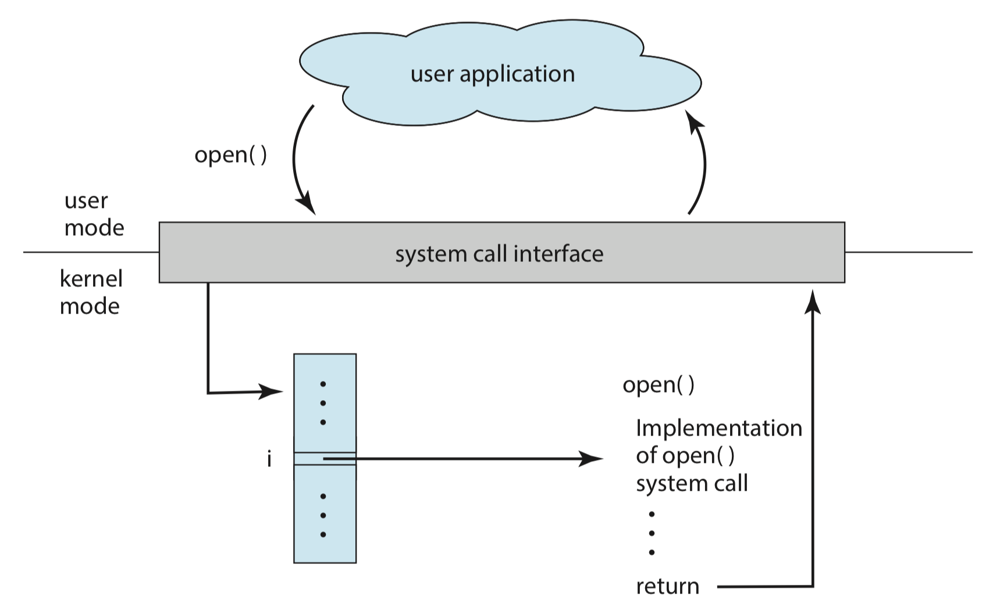

"This is the basic class for CS."

"And it is interesting. I mean if you can totally master it."

<!--more-->

# Concept
Framework of this chapter:
- basic concepts
- OS components
- OS services (Using components)
- System call (how to provide services)
- Structure
- virtual machine

These contents will be detailed written in the following chapters

## Operating system components
### :cherry_blossom:Process management
**process**: A process is a program in execution.
- program has its own address space


### OS activities:
- Process creation and deletion
  - using **fork** system call
- Process suspension and resumption (挂起或恢复)
- Provision of mechanism for:
  - process synchronization (进程同步)
    - such as two processes should share a variable to achieve a task or job. And synchronization mechanism helps to finish this job in a proper order.
  - process communication (进程通信)
  - deadlock handling (死锁处理)


### :cherry_blossom:Main memory management
**memory**: Memory is a large array of words or bytes, each with its own address. It is a repository of quickly accessible data shared by the CPU and I/O devices.

**Main memory** or **primary storage** is a volatile storage device (掉电易失设备).


### OS activities:
- Keep track of which parts of memory are currently being used and by whom.
- Decide which processes to load when memory space becomes available (Job scheduling, 任务调度).
- Allocate and deallocate memory space as needed.


**Virtual memory**: Virtual memory allows programs to address memory from a logical point of view. This technique allows applications **regard** that they have a continuous address space rather than fragmented spaces from main memory to disk memory.
- without regard to the limits of physical memory.

### :cherry_blossom:File management
**file**: A file is a collection of related information defined by its creator. Commonly, files represent programs (both source and object form) and data.
- this a uniform logical view of information storage provided by OS.


### OS activities:
- File creation and deletion.
- Directory (can be seen as a special file) creation and deletion.
- Support of primitive for manipulating files and directories.
- Mapping files onto secondary storage.
  - for large files, how to map them onto secondary storage?
- File backup (备份) on stable (nonvolatile) storage media.


*Windows file management is related to storage, but Linux not. In Linux, every thing is file, having a unified form to access files.*

**Mount (挂载)**: create a mounting point, and this file is can be accessed using mounting point.

### :cherry_blossom:I/O system management
The I/O subsystem consists of:
- a buffer-caching system
- a general device-driver interface (a driver is a part of OS, specific for devices)
  - programmed I/O
  - interrupt I/O
  - DMA
- drivers for specific hardware devices

### :cherry_blossom:Secondary-storage (disk) management
**Secondary storage** is the principle on-line storage medium (线性存储介质) for both programs and data.
- disk
- Main memory is volatile and too small to accommodate all data and programs permanently, so the computer must provide secondary storage to back up main memory.


### OS activities;
- Free space management (which parts of disk are free and how to allocate these free blocks)
- Storage allocation
- Disk scheduling (磁盘调度)
  - 磁头移动, 请求分布在不同柱面上, 相应时需要磁头在不同不同柱面上切换, 经过算法, 设计磁头移动的最短距离 (有计算题).


### :cherry_blossom:Protection system
**Protection** refers to a mechanism for controlling access by programs, processes, or users to both system and user resources.
- distinguish between authorized and unauthorized usage.
- specify the controls to be imposed and means for enforcement.

Example:
In Linux, file access control: **rwx**, **owner**, **user(u)**, **group(g)**, **other(o)**

### :cherry_blossom:Command-interpreter system
**Command-interpreter system**(命令行解释系统): Interact with users, users can send instructions to OS.
- Shell
- its functions is to get and execute the next command statement.

## Operating system services
### :cherry_blossom:Core operating system services
From the view of an user:

**Program execution**
- load a program into memory and to run it
  - process management, memory management, disk management and so on.

**I/O operations**
- user programs cannot execute I/O operations directly, the OS must provide some means to perform I/O.

**File-system manipulation**
- programs capability to read, write, create and delete files

**Communication**
- exchange information between processes

**Error detection**
- ensure correct computing in CPU, memory hardware, I/O devices, user programs

### :cherry_blossom:Additional operating system functions
From a view of system:

This part is user for **efficient system operations**, not for helping users.
- Resource allocation
- Accounting
- Protection

## System call
An user how to use system services:

Normally, we write C code and define the ``main`` function, this is a *system call*, but has been packaged to a convenient-to-use API.

**System call** is an **interface** between a running program and the OS.
- generally available as assembly-language instructions. (汇编语言形式呈现)
- user programs (in **user mode**, ``mode bit=1``) send a ``system call`` to the OS (in **kernel mode**, ``mode bit=0``), and the OS execute the system call, then the OS returns (and change the mode bit to 1), finally the user programs continue to execute.
- Common in the OS
- Some language like ``C`` language and ``C++`` are defined to replace assembly-language for system programming, which allow system call to be made directly.

### :cherry_blossom:The implementation of system call
Typically, a number (index) associated with each system call.
- System call interface maintains a table indexed according to these numbers

The system call interface invokes intended system call in OS kernel and returns status of the system call and any return values. (系统调用的接口使用OS内核中的系统调用, 并返回系统调用状态和相应参数)

The caller need to know **nothing** about how the system call in implemented.
- just need to **obey API** and understand what OS will do as a result call.
- Most details of OS interface hidden from programmer by API
  - manage run-time support library <u>(set of functions built into libraries included with compiler)</u>

In this picture, ``open()`` function acts as an API, and ``open()`` gives a system call (in the function library) to OS (maybe in the library, ``open()`` function use other system functions to give a system call, because ``open()`` is just an <u>API</u> of system call functions). Then the OS look up this system call in its number table and then execute a specific system program (according to the index number). Finally, the OS returns the states.

### :cherry_blossom:Parameter passing in system call
Often, more information is required than simply identity of desired system call.

Three types:
- simplest: pass the parameters in ***registers***
  - maybe more parameters than registers
- Parameters stored in a ***block***, or *table*, in memory. and pass the block address to registers.
  - taken by Linux and Solaris
- Parameters placed, or <u>pushed</u> onto the ***stack*** by program and <u>popped</u> off the stack by the OS.

<u>Block and stack don't limit the number and the length of parameters.</u>

### :cherry_blossom:Types of system call
Five main types:
- process control
- file management
- device management
- information maintenance
- communication

**process management**

<b>Table 1: process management for major POSIX system</b>

|call|description|
|----|-----------|
|``pid=fork()``|create a child process identical to the parent|
|``pid=waitpid(pid, &statloc, options)``|wait for a child to terminate|
|``s=execve(name, argv, environp)``|replace a process' core image|
|``exit(status)``|terminate process execution and return status|

**file management**

## System structure
### :cherry_blossom:UNIX
