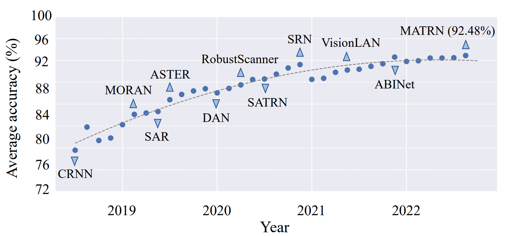
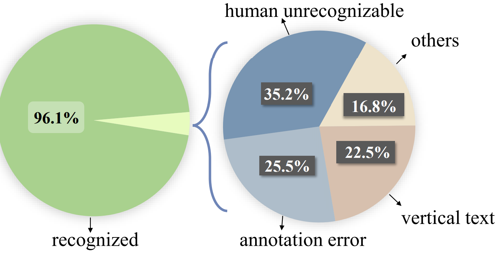
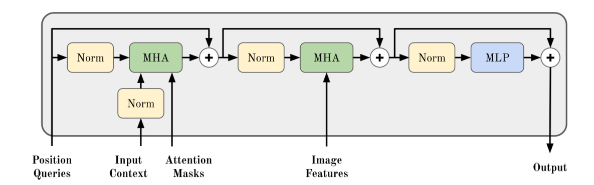
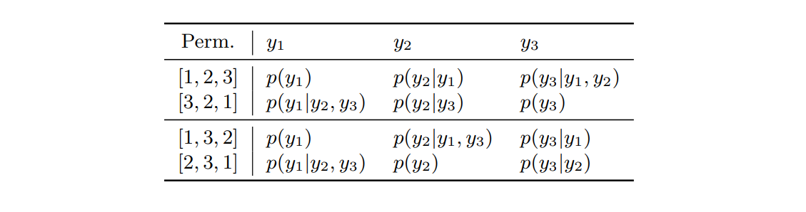
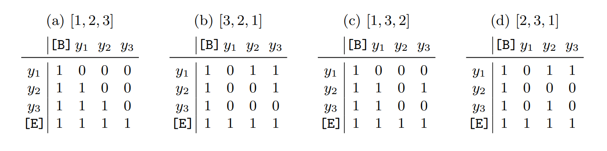
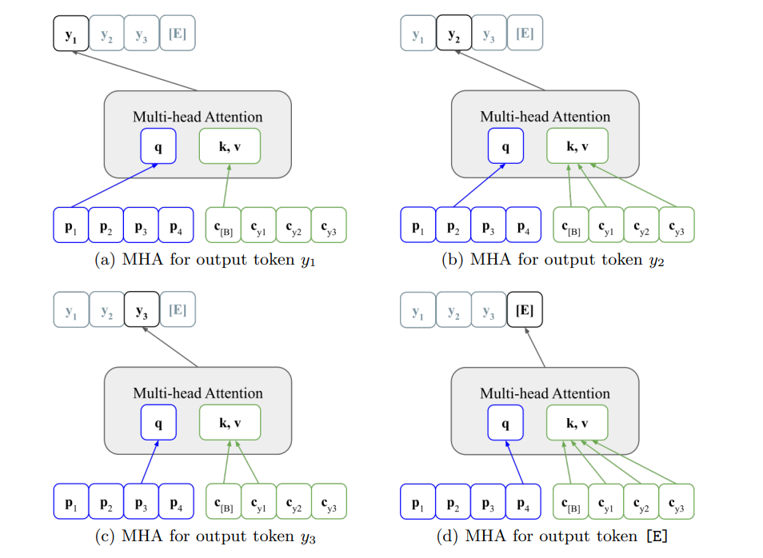

STR 的方法里面经常会使用自回归的语言模型（ARLM），当然考虑到自回归的一些缺点和局限性，也有人采用外置的语言模型。但是外置的语言模型（external LM）是条件独立的（conditional independence），有时会将正确的预测结果修正为错误的结果。本文提出的PARSeq（Permuted Autoregressive Sequence）模型使用了Permutation Language Modeling和Weight Sharing来集成自回归语言模型。

<!--more-->

[代码](https://github.com/baudm/parseq)，[论文](https://arxiv.org/abs/2207.06966)

## Introduction

本文先介绍了什么是STR任务并说明该任务成果的应用场景和当前问题，并提出 **STR任务在某些情况下不能仅仅依靠image features来做推理，而是要依赖一定的language semantics**。STR网络中内置的语言模型一般是自回归的，不仅能够处理语言特征还能联合地处理图像特征。通常的自回归策略是<u>根据过去的时刻的预测值来预测当前时刻的值</u>： $P(\mathbf{y} | \mathbf{x})=\prod_{t=1}^{T} P(y_t | \mathbf{y}_{<t}, \mathbf{x})$ （其中 $\mathbf{y}$ 是一个长度为$T$的文本序列， $\mathbf{x}$ 是图像）。这样的自回归策略有两个缺点：

- 单向性：文本序列的预测要么从左到右，要么从右到左。预测结果和顺序有一定的关系。
- 推理的时候，输出的序列顺序和训练是一样的。

为了解决“单向”的问题，有人提出了 **ABINet** 的模型，它主要使用掩码的方式，在注意力层多加了一层掩码：$P(\mathbf{y} | \mathbf{x}) = \prod_{t=1}^{T}P(y_t | \mathbf{x})$，其中 $P(\mathbf{y}) = \prod_{t=1}^{T}P(y_t | \mathbf{y}_{t\neq 1})$，即在预测某个字符时，将其做掩码，用其余字符对掩码字符进行预测，这样的好处是能够 **利用双向** 的字符特征。但是在 ABINet 中，作者采用的是 independent LM，可以单独训练，不依赖于 image model，用于 *纠正* image model 的错误。但是当语言模型本身的预测结果就是错误的，又何谈 *纠错* 呢？于是为了利用image和text两种特征，ABINet 的作者又加了 fusion 模块，但本文作者认为这种方式带来了巨大的参数数量。

看了序列模型的综述，本文发现目前比较常用的、研究较多的一类模型是 *序列生成模型*，作者认为可以将这些模型结合context-free和context-aware后泛化在STR任务中。并且能将 *外部* 的语言模型转化为 *内部* 的。本文着重关注的是 Permutation Language Model (PLM)，后续本文会说明是如何改进PLM，让其更加适用于STR。本文提到：*PLM模型可以看作是自回归的一种泛化，能够使用 **共享的结构和权值集成** 多个自回归模型*。如下图所示

本文类似这种方式，提出了用于STR任务的PARSeq（Permuted Autoregressive Sequence）模型，并且表现还不错。

## Related Work

本文在这一节主要从三个方面来总结STR的工作，分别是context-free STR, context-aware STR 和 generation from sequence model。

- context-free STR：直接从图片中预测字符串，每一个字符是概率独立的。缺点是low robust，于是大家开始利用语言模型来指导图片文本的识别
- context-ware STR：在图片的文字识别中加入语言模型作为指导，但是会出现两种方式：一种是所谓的external LM，也就是直接使用现有的语言模型，主要用于通过集成、迭代等方式提升预测的准去率；一种是internal LM，主要是跟着自己的模型一起训练。不过对于后者，传统的做法是使用monotonic and standard AR训练方式，PARSeq使用的是PLM方式。
- generation from sequence model：
  - autoregressive (one token at a time)
  - non-regressive (all token predicted at once)

## Permuted Autoregressive Sequence Models

在这一节中，会像大部分论文一样采用三段论：先介绍整体的模型架构，再介绍训练的方式，最后讨论如何运用训练好的模型做推理。

### 模型架构

整体的PARSeq模型依然是熟悉的encoder-decoder架构，这种架构在处理序列型任务中表现很好。在本文设计的PARSeq模型中，encoder有12层，但decoder只有一层。encoder主要是面向image设计的，采用的是ViT-encoder（如图中Vit Encoder）所示；而decoder部分有三个输入（position queries, context, image tokens）和一个可选的mask（attention mask）。decoder内部有两个多头注意力（MHA）和一个MLP，每一个部分都采用残差连接。PARSeq模型的最大特点在于其 **mask的设计**，即采用了 permutation的方式对输入context的序列进行 *理解层面* 的排列。从这里就可以看出一条context序列在训练时对应的训练数据不止一个。

**ViT Encoder**

首先了解图中的`embedded patches`是怎么来的。与原始的ViT不同，该模型舍弃了`[cls]` token。对于输入的image $\mathbf{x}\in \mathbb{R}^{W\times H\times C}$，对其进行所谓的 *tokenize* 操作：即在 $W\times H$ 的维度上进行切分，每一份称之为一个 *patch*，切分的尺度为 $p_w\times p_h$，也即切分成了 $W/p_w \times H/p_h$ 份 *patches*，将每一个 *patch*进行 *flatten* 后，得到一维的且长度为 $p_w\times p_h \times C$ 的向量，最后对每一个这样的向量做线性投影 $W^p\in \mathbb{R}^{p_w p_h C \times d_{model}}$，其中 $d_{model}$ 是一个超参，最后得到的长度为 $d_{model}$ 的向量称之为一个 **token**，一共有 $W/p_w \times H/p_h$ 个 token。

得到`embedded patches`后，将其输入自注意力模块，最终通过12层的处理得到输出的 *图片特征* $z$。

**Visio-lingual Decoder**

对前文整体架构的decoder部分做了一个补充，该部分只有1层。

### Permutation Language Modeling

该部分是本文的核心部分，主要讨论的是多头注意力的mask设计。对于标准的自回归模型，使用的都是根据时间 **按顺序** 进行预测，从而最大化似然函数 $\log p(\mathbf{y} | \mathbf{x}) = \sum\limits_{t=1}^{T}\log p_{\theta}(y_t | \mathbf{y}_{<t}, \mathbf{x})$。但是这种方式对于注意力机制可能不太合理，毕竟注意力是在全局上提取特征的，如果真的想用自回归，也是没问题的，只要在注意力计算中添加如下的mask即可（假设输入是长度为3的context，包括`[B], [E]`后长度为4）：

$$
\begin{matrix}
  1 & 0 & 0 & 0 \\
  1 & 1 & 0 & 0 \\
  1 & 1 & 1 & 0 \\
  1 & 1 & 1 & 1
\end{matrix}
$$

其中每一行表示要预测的字符，每一列表示输入的字符。即第一个要预测的字符（第一行）由开始符号`[B]`（第一列）来预测（其实就是用整张图片image来预测），而第二个要预测的字符（第二行）由第一个输入字符（第二列）来预测，以此类推。**这种方式是标准的自回归mask，根据时间顺序来进行mask，防止在预测当前字符时使用“未来”的信息**。

但是对于 **PLM（permuted language model）** 而言，本质思想是在每一个字符串的 **所有排列** 上做训练，也就是一个字符串对应的 $T!$ 个排列上训练，这种模型对应的对数似然为：

$$
\log p(\mathbf{y} | \mathbf{x}) = \mathbb{E}_{\mathbf{z}\sim\mathcal{Z}_T}\lbrack \sum\limits_{t=1}^{T}\log p_{\theta}(y_{z_t} | \mathbf{y}_{\mathbf{z}<t},\mathbf{x}) \rbrack
$$

> 一个比较好的理解方式：自回归其实是这种方式的一种特例，是“严格”的。将所有排列作为横轴，则自回归mask进行训练采用的是“冲激函数”的形式，而permutation的mask是将其视作分布，将冲激进行了一次平滑处理，最后的输出则是这个分布的期望。

> 值得一提：本文 **并没有** 在数据层面上进行全排列，而是设计了多种mask来体现全排列。

**排列的选择方式**

本文在这里的设计十分巧妙。嘴上说着随机从所有排列中选取 $K$ 个排列生成mask，但实际上是这样做的：

- 随机选取 $K/2$ 个排列，其中一个为正排列，即 $\lbrack 1,2,3,\cdots,T \rbrack$
- 另一半 $K/2$ 个排列是 **上述排列的倒序**

在附录中，作者说明这样选择的优势

如上表所示

- 在推理阶段，输入的必然是正排列，因此训练的mask中必须含有正排列对应的mask才比较合理
- 而对于 **一对** 正反排列，**每一个字符都由其它另外的字符作为条件** 进行估计，二者互补

**Permutation Mask的计算顺序**

虽然名为“排列”，但是其计算顺序并未改变，因为该模型采用的是掩码方式，而不是扩增数据集的方式。
permutation mask的方式如下所示

结合前文的条件概率，以 $[1,3,2]$ 为例， $p(\mathbf{y} | \mathbf{x}) = p(y_1 | \mathbf{x}) p(y_3 | y_1, \mathbf{x}) p(y_2 | y_3, y_2, \mathbf{x})$，即计算顺序依然是从左到右，在预测 $y_1$ 时由于没有其它任何字符被预测出来，因此只能根据图片 $\mathbf{x}$ 进行预测；而对于 $y_3$ 此时 $y_1$ 已经被预测出来，可以作为条件去预测 $y_3$，因此mask在 $y_1$ 处是 $1$；而最后预测的 $y_2$ 使用了 $y_1, y_3$ 作为条件，对应的掩码位置也是 $1$。具体过程如下图所示。

通过permutation mask的方式，对不同的permutation都对 $t>T$ 时的字符进行了mask，防止“看到”后续的信息，但不同的排列结合后又 *有可能* 得到完整信息。

### Overall Formula

模型输出

$$
\mathbf{y} = \mathbf{Decoder}(\mathbf{z},\mathbf{p},\mathbf{c},\mathbf{m}) \in \mathbb{R}^{(T+1)\times S+1}
$$

图片特征为

$$
\mathbf{z} = \mathbf{Encoder}(\mathbf{x}) \in \mathbb{R}^{\frac{WH}{p_w p_h}\times d_{model}}
$$

## Appendix

### ViT 编码输入编码方式