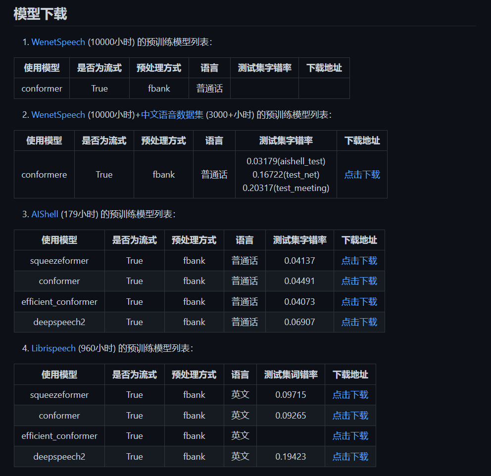

## TODO List

- [ ] 优化场景的光照
- [ ] 优化人物/动物的行为
- [ ] 优化语言输入中的数据库匹配
- [ ] 添加主角本体
- [ ] 优化/丰富NPC/场景交互

整体的思路

- 语音识别模块：使用流式语音处理的预训练模型，用爬虫爬取古诗文网中的古诗和语音作为训练集训练模型
- 场景生成模块：根据语音识别结果生成对应场景

困难

- 语音识别模块
  - 模型的选择
  - 数据集的构建（第一周实践后发现有部分古诗词原文有注释，和录音不能很好匹配，需要手动调整）
  - 关键词如何匹配（语音识别后如何快速将识别结果和关键词进行匹配，由于中文一个读音有多种对应的汉字，如何进行匹配）
- 场景生成模块
  - **不会真要为每一首诗单独创建一个场景吧！**
  - 目前的方案是把场景分为主要场景和次要场景，主要场景根据诗词里面的特色单独人工搭建，次要场景随机生成

## 第一周

- 寻找语音识别模型

  - 流式语音处理
  - 对中文准确率高
  - 最好是预训练的，可以将进行古诗文/语音的适配
- 学习/熟悉Unity的VR开发

  - 先了解了无设备开发
  - 在连接设备的情况下如何进行开发（目前找到了网课讲解SteamVR和HTCVive）
  - 场景的搭建（之前在实验室主机上面查看了整个项目的场景，配色偏暗，想修改，但是不是当务之急）

- [ ] **目前做的事情**

- 爬虫能爬取古诗词原文（还不能爬取语音）
- 预训练模型选择的是MASR框架，[项目地址]([https://github.com/yeyupiaoling/MASR]())，内部提供了多个预训练模型，并且能支持流式的语音处理
  - [论文](https://arxiv.org/pdf/2102.01547.pdf)
  - [讲解](https://zhuanlan.zhihu.com/p/349586567)

- 浅学了一下Unity的VR开发（没有借设备，只是听课）
